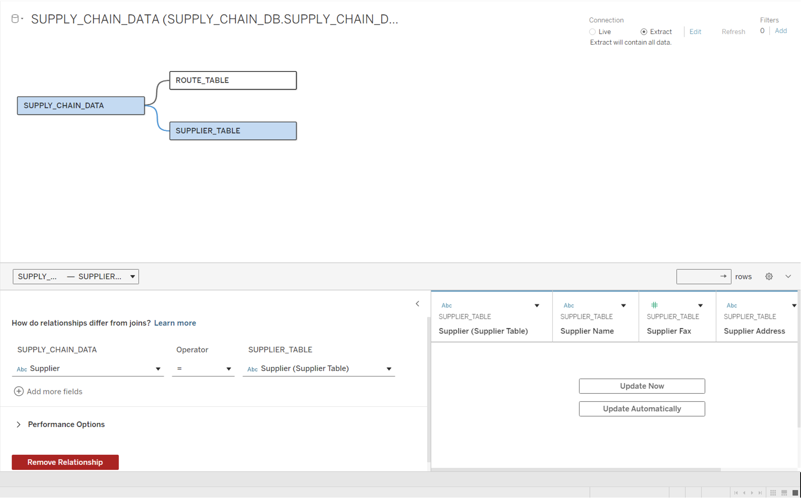

# 📦 Delhivery Analytics

An end-to-end analytics solution built as a **proof of concept (PoC)** for Delhivery—India’s leading logistics provider. This modern, interactive dashboard mimics the aesthetics of the [Delhivery website](https://www.delhivery.com/) and empowers stakeholders with real-time, actionable insights across operations, revenue, and product metrics.

---

## 🧠 Project Context

Delhivery provided a supply chain dataset in CSV format and requested a robust, real-time analytics dashboard that:

- Reflects the **look and feel of their official website**
- Replaces manual Excel-based analysis with a live, cloud-based data warehouse (Snowflake)
- Offers **deep-dive visual analytics**, granular filters, and **complete data exports** in a tabular format

This project was executed as a PoC to showcase the power of modern BI tools and cloud data warehousing in solving real-world logistics problems.

---

## 🎯 Project Objectives

- Design a dashboard that visually mirrors the Delhivery website
- Migrate all data from static CSV/Excel files to a Snowflake data warehouse
- Enable **real-time data refresh** and eliminate spreadsheet dependency
- Provide deep analytics across:
  - Orders, revenue, stock levels, shipping cost, and defects
  - Dimensions like product, carrier, supplier, route, customer gender, and more
- Implement comprehensive filters to allow slicing/dicing by any metric
- Add a one-click **data export** button for full tabular download

---

## 🗃️ Dataset Description

The dataset included **3 CSV files** with a combined schema of **18 columns**. After performing **data cleaning and validation in Excel**, the files were consolidated and loaded into Snowflake.

| Column Name         | Description                            |
| ------------------- | -------------------------------------- |
| CARRIER             | Carrier or logistics provider          |
| CUSTOMER Gender     | Gender of the customer                 |
| LOCATION            | Transaction location                   |
| MODE                | Mode of delivery                       |
| PRODUCT             | Product name/ID                        |
| PRODUCT TYPE        | Category/type of product               |
| ROUTE               | Shipping/delivery route                |
| SUPPLIER            | Product supplier                       |
| AVAILABILITY (PCT)  | Product availability percentage        |
| DEFECT RATE (PCT)   | Percentage of products with defects    |
| ORDERS              | Number of orders                       |
| PRICE               | Price per unit                         |
| PRODUCTION          | Production figures                     |
| PRODUCTS SOLD       | Number of products sold                |
| REVENUE             | Total revenue generated                |
| STOCK LEVEL         | Current inventory/stock level          |
| Shipping costs      | Cost incurred for shipping             |
| Year of Transaction | Year in which the transaction occurred |

---

## 🏗️ Architecture & Workflow

```text
CSV Files → Excel Cleaning → Snowflake Warehouse → Tableau Dashboard (Live Connection)
```

---

### 🔄 Why Snowflake?

The client requested **no further use of CSV/Excel** and emphasized the need for a **cloud-based, scalable** data platform. Snowflake was chosen for its:

- Seamless integration with Tableau
- Ability to handle large datasets efficiently
- Secure and centralized data management

---

## 📊 Dashboard Features

- **Order Tracking**: Real-time count of warehouse-dispatched orders
- **Revenue Analytics**: Revenue trends across dimensions
- **Product Availability**: Percent availability of stock
- **Defect & Leakage Tracking**: Breakdown by product, location, and carrier
- **Shipping Cost Analysis**: Costs visualized per order and unit
- **Unit Contribution**: Impact of individual units on total sales
- **Safety Metrics**: Monitored across product types and carriers
- **Data Export**: One-click tabular download of the entire dataset
- **Comprehensive Filters**: Multi-level slicing by:
  - Location
  - Gender
  - Role
  - Carrier
  - Product
  - Product Type
  - Year of Transaction
  - Supplier
  - Mode

---

## ⚙️ Tech Stack

- **Data Cleaning**: Microsoft Excel
- **Data Warehouse**: Snowflake
- **Business Intelligence**: Tableau

---

## 🧱 Data Modeling

---

- Modeled using a **star schema** with dimension and fact tables in Snowflake
- Relationships optimized for dashboard performance and accurate joins

---

## 🖥️ Dashboard Preview


---

## 🗺️ Data Model



---

## 📁 Repository Structure

```text
/
├── Delhivery Datasets/            # Contains original CSV datasets
├── Delhivery Dashboard.twbx       # Tableau packaged workbook (linked to Snowflake)
├── README.md                      # This documentation file
├── gif.gif                        # Dashboard walkthrough GIF
├── db1.png, db2.png, db3.png      # Dashboard screenshots
├── datamodel.png                  # Data model image

```

---

## ✅ Outcome

The project successfully met all client requirements, demonstrating:

- End-to-end BI pipeline design
- Live connection setup with Tableau and Snowflake
- Functional UI replicating a real-world logistics company dashboard

## 🚀 Future Improvements

- Automate data loading to Snowflake using Airflow or DBT
- Integrate real-time APIs instead of static CSVs
- Add anomaly detection for defect rate spikes
